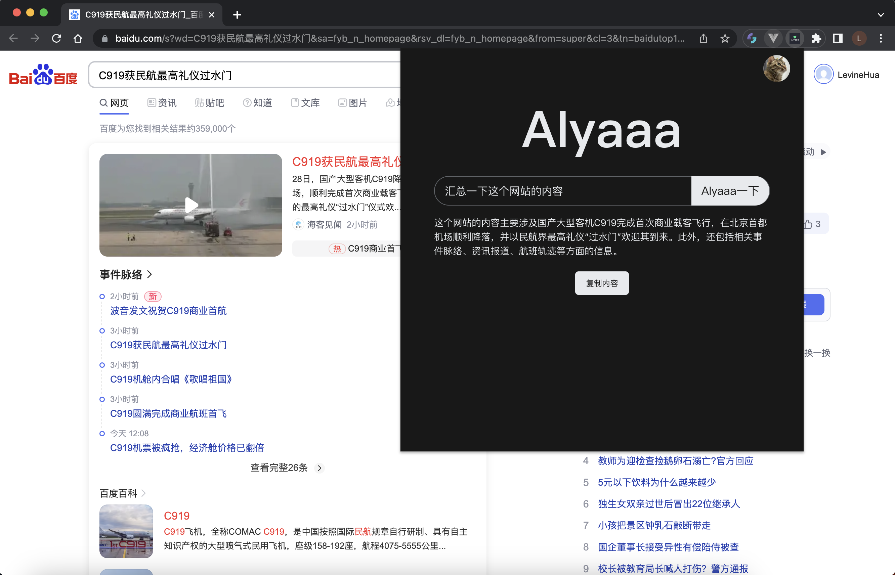

# AIyaaa一下

`AIyaaa一下`是一个类似百度、Google 的搜索引擎，它是基于 ChatGPT  3.5的 Chrome 扩展程序。它除了能完成基础的搜索任务，还有更多可玩的指令可以使用。

## 安装

### 一键自动安装（需翻墙）

[Chrome 应用市场](https://chrome.google.com/webstore/detail/aiyaaa%E4%B8%80%E4%B8%8B/ihplgloeiohhhdkehpchgadmimnjjdmf/related?hl=zh-CN)

### 压缩包安装

首先下载插件包

* 百度网盘：链接: https://pan.baidu.com/s/17LSCB7a6MTlKvnsliCwncQ?pwd=wlh2 提取码: wlh2
* GitHub：https://github.com/LevineHua/aiyaaa-chrome-extensions/blob/main/AIyaaa%E4%B8%80%E4%B8%8B.zip

解压下载下来的插件包

然后打开[chrome 浏览器扩展程序](chrome://extensions/)，打开开发者模式

将解压后的拖拽进扩展程序或点击“加载已解压的扩展程序”安装，安装后就能在扩展程序看到了

这个时候“AIyaaa 一下”插件还没有在右上角的插件栏中显示，点击右上角的扩展程序图标，然后把该插件“钉”在插件栏我们就可以在插件栏看到了

### 手动安装

1. Clone 代码 `git clone https://github.com/LevineHua/aiyaaa-chrome-extensions.git`
2. `yarn`
3. `yarn build`
4. 安装步骤同上，将打包后的`AIyaaa一下`文件通过扩展管理打开

## 体验“AIyaaa 一下”

打开插件后是这样的

初次打开插件是未登录的，需要先微信登录一下，第一次登录需要绑定一下手机号，因为[AIyaaa](http://dwz.cblink.net/af5a067c496063d9)不仅只有插件版，也有 pc、h5 版，登录是为了用户数据同步

登录成功后就可以使用了

## 功能

* 搜索功能
* 复制内容
* 总结网页内容
* 文生图功能（规划中）

## 指令使用文档

[《AIyaaa一下 - 使用文档》](https://github.com/LevineHua/aiyaaa-chrome-extensions/blob/main/src/document/makdown/index.md)

